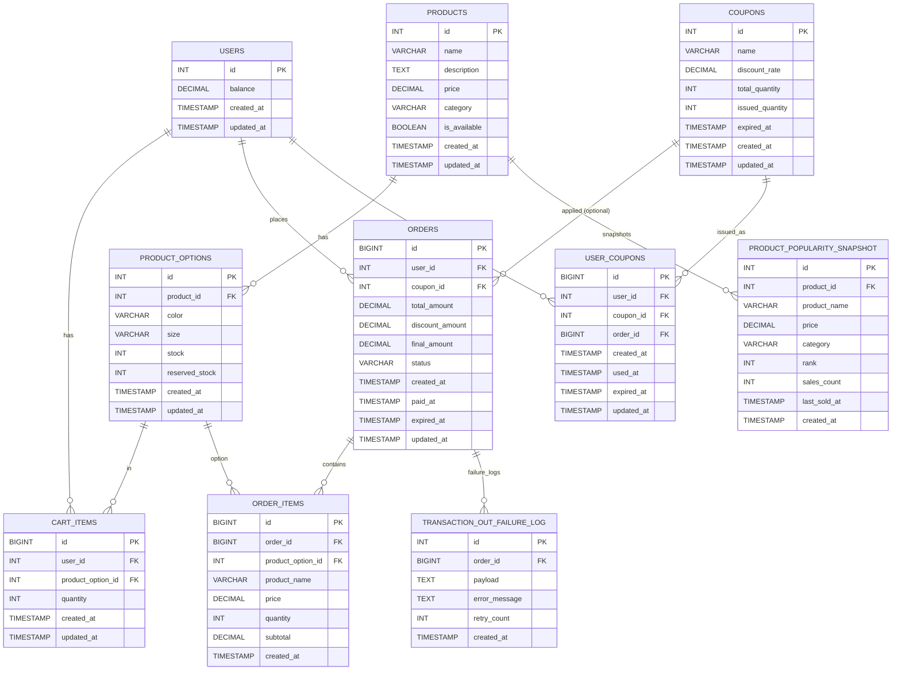

# 데이터 모델

## ERD



## DDL

### Users Table: 사용자 정보 및 잔액 관리

```
CREATE TABLE users (
    id INT AUTO_INCREMENT PRIMARY KEY,
    balance DECIMAL(13, 0) NOT NULL DEFAULT 0,
    created_at TIMESTAMP NOT NULL DEFAULT CURRENT_TIMESTAMP,
    updated_at TIMESTAMP NOT NULL DEFAULT CURRENT_TIMESTAMP ON UPDATE CURRENT_TIMESTAMP,
    INDEX idx_id (id)
) ENGINE=InnoDB DEFAULT CHARSET=utf8mb4 COLLATE=utf8mb4_unicode_ci;
```

### Products Table: 상품 정보

```
CREATE TABLE products (
    id INT AUTO_INCREMENT PRIMARY KEY,
    name VARCHAR(255) NOT NULL,
    description TEXT,
    price DECIMAL(13, 0) NOT NULL,
    category VARCHAR(100) NOT NULL,
    is_available BOOLEAN NOT NULL DEFAULT TRUE, -- 상품 판매 가능 여부 (재고와 별개)
    created_at TIMESTAMP NOT NULL DEFAULT CURRENT_TIMESTAMP,
    updated_at TIMESTAMP NOT NULL DEFAULT CURRENT_TIMESTAMP ON UPDATE CURRENT_TIMESTAMP,
    INDEX idx_id (id)
) ENGINE=InnoDB DEFAULT CHARSET=utf8mb4 COLLATE=utf8mb4_unicode_ci;
```

### Product Options Table: 상품 옵션 및 재고 관리

```
CREATE TABLE product_options (
    id INT AUTO_INCREMENT PRIMARY KEY,
    product_id INT NOT NULL,
    color VARCHAR(50),
    size VARCHAR(50),
    stock INT NOT NULL DEFAULT 0,
    reserved_stock INT NOT NULL DEFAULT 0,
    created_at TIMESTAMP NOT NULL DEFAULT CURRENT_TIMESTAMP,
    updated_at TIMESTAMP NOT NULL DEFAULT CURRENT_TIMESTAMP ON UPDATE CURRENT_TIMESTAMP,
    INDEX idx_id (id),
    FOREIGN KEY (product_id) REFERENCES products(id) ON DELETE CASCADE
) ENGINE=InnoDB DEFAULT CHARSET=utf8mb4 COLLATE=utf8mb4_unicode_ci;
```

### Cart Items Table: 장바구니

```
CREATE TABLE cart_items (
    id BIGINT AUTO_INCREMENT PRIMARY KEY,
    user_id INT NOT NULL,
    product_option_id INT NOT NULL,
    quantity INT NOT NULL DEFAULT 1,
    created_at TIMESTAMP NOT NULL DEFAULT CURRENT_TIMESTAMP,
    updated_at TIMESTAMP NOT NULL DEFAULT CURRENT_TIMESTAMP ON UPDATE CURRENT_TIMESTAMP,
    INDEX idx_user_id (user_id),
    UNIQUE KEY uk_user_product_option (user_id, product_option_id),
    FOREIGN KEY (user_id) REFERENCES users(id) ON DELETE CASCADE,
    FOREIGN KEY (product_option_id) REFERENCES product_options(id) ON DELETE CASCADE
) ENGINE=InnoDB DEFAULT CHARSET=utf8mb4 COLLATE=utf8mb4_unicode_ci;
```

### Coupons Table: 쿠폰 정보 (관리자에 의해 수량이 변경될 수 있음)

```
CREATE TABLE coupons (
    id INT AUTO_INCREMENT PRIMARY KEY,
    name VARCHAR(255) NOT NULL,
    discount_rate DECIMAL(5, 2) NOT NULL COMMENT "백분율 할인 (예: 15.30 = 15.30%)",
    total_quantity INT NOT NULL,
    issued_quantity INT NOT NULL DEFAULT 0,
    expired_at TIMESTAMP NOT NULL,
    created_at TIMESTAMP NOT NULL DEFAULT CURRENT_TIMESTAMP,
    updated_at TIMESTAMP NOT NULL DEFAULT CURRENT_TIMESTAMP ON UPDATE CURRENT_TIMESTAMP,
    INDEX idx_expired_at (expired_at)
) ENGINE=InnoDB DEFAULT CHARSET=utf8mb4 COLLATE=utf8mb4_unicode_ci;
```

### Orders Table: 주문 정보

```
CREATE TABLE orders (
    id BIGINT AUTO_INCREMENT PRIMARY KEY,
    user_id INT NOT NULL,
    coupon_id INT NULL,
    total_amount DECIMAL(13, 0) NOT NULL,
    discount_amount DECIMAL(13, 0) NOT NULL DEFAULT 0,
    final_amount DECIMAL(13, 0) NOT NULL,
    status VARCHAR(20) NOT NULL DEFAULT 'PENDING', -- PENDING, PAID, EXPIRED
    created_at TIMESTAMP NOT NULL DEFAULT CURRENT_TIMESTAMP,
    paid_at TIMESTAMP NULL,
    expired_at TIMESTAMP NOT NULL,
    updated_at TIMESTAMP NOT NULL DEFAULT CURRENT_TIMESTAMP ON UPDATE CURRENT_TIMESTAMP,
    INDEX idx_user_id (user_id),
    INDEX idx_created_at (created_at),
    INDEX idx_paid_at (paid_at),
    FOREIGN KEY (user_id) REFERENCES users(id) ON DELETE RESTRICT,
    FOREIGN KEY (coupon_id) REFERENCES coupons(id) ON DELETE RESTRICT
) ENGINE=InnoDB DEFAULT CHARSET=utf8mb4 COLLATE=utf8mb4_unicode_ci;
```

### Order Items Table: 주문 상품 상세

```
CREATE TABLE order_items (
    id BIGINT AUTO_INCREMENT PRIMARY KEY,
    order_id BIGINT NOT NULL,
    product_option_id INT NOT NULL,
    product_name VARCHAR(255) NOT NULL,
    price DECIMAL(13, 0) NOT NULL, -- snapshot price, 상품의 현재가격을 참조하지 않음
    quantity INT NOT NULL,
    subtotal DECIMAL(13, 0) NOT NULL,
    created_at TIMESTAMP NOT NULL DEFAULT CURRENT_TIMESTAMP,
    INDEX idx_order_id (order_id),
    FOREIGN KEY (order_id) REFERENCES orders(id) ON DELETE CASCADE,
    FOREIGN KEY (product_option_id) REFERENCES product_options(id) ON DELETE RESTRICT
) ENGINE=InnoDB DEFAULT CHARSET=utf8mb4 COLLATE=utf8mb4_unicode_ci;
```

### User Coupons Table: 사용자별 발급된 쿠폰

```
CREATE TABLE user_coupons (
    id BIGINT AUTO_INCREMENT PRIMARY KEY,
    user_id INT NOT NULL,
    coupon_id INT NOT NULL,
    order_id BIGINT NULL,
    created_at TIMESTAMP NOT NULL DEFAULT CURRENT_TIMESTAMP,
    used_at TIMESTAMP NULL,
    expired_at TIMESTAMP NOT NULL,
    updated_at TIMESTAMP NOT NULL DEFAULT CURRENT_TIMESTAMP ON UPDATE CURRENT_TIMESTAMP,
    INDEX idx_user_id (user_id),
    INDEX idx_coupon_id (coupon_id),
    INDEX idx_expired_at (expired_at),
    UNIQUE KEY uk_user_coupon (user_id, coupon_id),
    FOREIGN KEY (user_id) REFERENCES users(id) ON DELETE CASCADE,
    FOREIGN KEY (coupon_id) REFERENCES coupons(id) ON DELETE RESTRICT,
    FOREIGN KEY (order_id) REFERENCES orders(id) ON DELETE SET NULL
) ENGINE=InnoDB DEFAULT CHARSET=utf8mb4 COLLATE=utf8mb4_unicode_ci;
```

### Product Popularity Snapshot Table: 인기 상품 캐시 (배치 생성)

```
CREATE TABLE product_popularity_snapshot (
    id INT AUTO_INCREMENT PRIMARY KEY,
    product_id INT NOT NULL,
    product_name VARCHAR(255) NOT NULL,
    price DECIMAL(13, 0) NOT NULL,
    category VARCHAR(100) NOT NULL,
    `rank` INT NOT NULL,
    sales_count INT NOT NULL,
    last_sold_at TIMESTAMP NULL,
    created_at TIMESTAMP NOT NULL DEFAULT CURRENT_TIMESTAMP,
    INDEX idx_created_at (created_at),
    INDEX idx_rank (`rank`),
    FOREIGN KEY (product_id) REFERENCES products(id) ON DELETE CASCADE
) ENGINE=InnoDB DEFAULT CHARSET=utf8mb4 COLLATE=utf8mb4_unicode_ci;
```

### Transmission Failure Log Table: 외부 데이터 전송 실패 로그

```
CREATE TABLE transaction_out_failure_log (
    id INT AUTO_INCREMENT PRIMARY KEY,
    order_id BIGINT NOT NULL,
    payload TEXT NOT NULL,
    error_message TEXT,
    retry_count INT NOT NULL DEFAULT 0,
    created_at TIMESTAMP NOT NULL DEFAULT CURRENT_TIMESTAMP,
    INDEX idx_order_id (order_id),
    INDEX idx_created_at (created_at),
    FOREIGN KEY (order_id) REFERENCES orders(id) ON DELETE RESTRICT
) ENGINE=InnoDB DEFAULT CHARSET=utf8mb4 COLLATE=utf8mb4_unicode_ci;
```
