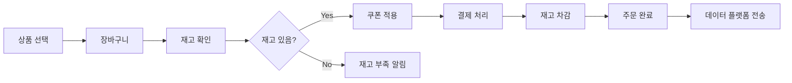

# 이커머스 시스템 요구사항 명세서

## 1. 프로젝트 개요

본 이커머스 시스템은 상품 조회, 주문/결제, 쿠폰 발급 등 고객 중심의 핵심 전자상거래 기능을 제공합니다.

```markdown
## 이커머스 핵심 기능

1. 상품 관리

   - 상품 정보 조회 (가격, 재고)
   - 재고 실시간 확인
   - 인기 상품 통계 (최근 3일, Top 5)

2. 주문/결제 시스템

   - 장바구니 기능
   - 재고 확인 및 차감
   - 잔액 기반 결제
   - 쿠폰 할인 적용
   - 잔액 변경 이력 조회

3. 쿠폰 시스템

   - 선착순 발급 (한정 수량)
   - 쿠폰 유효성 검증
   - 사용 이력 관리

4. 데이터 연동
   - 주문 데이터 외부 전송
   - 실패 시에도 주문은 정상 처리
```



## 2. 스테이크홀더

### 2.1 주요 이해관계자

- **고객 (Customer)**: 상품을 조회하고 구매하는 일반 사용자
- **외부 데이터 플랫폼**: 마케팅 목적으로 주문 데이터를 수신하는 외부 시스템

### 2.2 비즈니스 목표

- 안정적인 상품 조회 및 주문 서비스 제공
- 실시간 재고 관리를 통한 정확한 구매 경험 제공
- 선착순 쿠폰 시스템을 통한 고객 유입 촉진
- 마케팅 데이터 연동을 통한 비즈니스 인사이트 확보

## 3. 기능적 요구사항

### 3.1 상품 조회

> **참고**: 상품 등록/수정/삭제(CUD) 기능은 ADMIN 기능으로 본 요구사항 범위에서 제외

- **RF-001**: 사용자는 상품 목록을 조회할 수 있어야 한다
  - 상품 정보: 상품ID, 이름, 가격, 설명, 카테고리
- **RF-002**: 사용자는 상품 상세 정보를 조회할 수 있어야 한다
  - 실시간 재고 수량 포함
- **RF-003**: 사용자는 최근 3일간 판매량 기준 인기 상품 Top 5를 조회할 수 있어야 한다
  - 순위, 상품 정보, 판매 수량 포함

### 3.2 잔액 관리

> **참고**: PG사 연동 대신 포인트/잔액 방식으로 간소화, 사용자 포인트는 관리자(DB수정)가 충전해준다.

- **RF-004**: 사용자는 본인의 잔액을 조회할 수 있어야 한다

### 3.3 장바구니

- **RF-005**: 사용자는 장바구니에 상품을 추가할 수 있어야 한다
  - 상품ID, 상품옵션(수량, 컬러 등) 지정
- **RF-006**: 사용자는 장바구니 목록을 조회할 수 있어야 한다
  - 상품 정보, 수량, 가격 포함
- **RF-007**: 사용자는 장바구니 상품을 삭제할 수 있어야 한다

### 3.4 주문/결제

- **RF-008**: 사용자는 주문을 생성할 수 있어야 한다
  - 장바구니 상품 기반 주문서 생성
  - 재고 확인 및 임시 선점 (주문서 생성 진입 시)
  - 쿠폰 적용 가능
- **RF-009**: 시스템은 주문서 생성 시 재고를 검증해야 한다
  - 재고 부족 시 주문서 생성 실패 처리
- **RF-010**: 사용자는 주문에 대한 결제를 진행할 수 있어야 한다
  - 포인트 잔액 차감 방식
  - 결제 완료 시 주문서 상태 완료처리, 재고 확정 차감
- **RF-011**: 시스템은 결제 실패 시 선점한 재고를 복원해야 한다
- **RF-012**: 시스템은 결제 창 진입 후 일정 시간(10분) 내 미결제 시 선점 재고를 자동 해제해야 한다
- **RF-013**: 사용자는 본인의 주문 내역을 조회할 수 있어야 한다

### 3.5 쿠폰

- **RF-014**: 사용자는 선착순으로 쿠폰을 발급받을 수 있어야 한다
  - 한정 수량 관리
  - 사용자당 쿠폰별 1회만 발급 가능
- **RF-015**: 시스템은 쿠폰 발급 가능 여부를 실시간으로 확인해야 한다
  - 발급 수량이 총 수량에 도달하면 발급 불가
- **RF-016**: 사용자는 보유 쿠폰 목록을 조회할 수 있어야 한다
  - 쿠폰명, 할인율, 만료일, 사용 여부
- **RF-017**: 시스템은 주문 시 쿠폰 유효성을 검증해야 한다
  - 만료 여부, 사용 여부, 적용 가능 여부 확인
- **RF-018**: 시스템은 결제 완료 시 사용된 쿠폰을 사용 처리해야 한다

### 3.6 외부 데이터 연동

> **참고**: 마케팅 목적의 데이터 전송으로 별도 DB 테이블 불필요

- **RF-019**: 시스템은 주문 완료 시 외부 데이터 플랫폼으로 주문 정보를 전송해야 한다
  - 비동기 처리 방식
- **RF-020**: 외부 데이터 전송 실패는 주문 완료를 방해하지 않아야 한다
  - 주문은 정상 처리되고, 데이터 전송만 실패 로그 기록

### 3.7 잔액 변경 이력

- **RF-021**: 시스템은 사용자 잔액이 변경될 때마다 잔액 변경 로그를 기록해야 한다
  - 동일 트랜잭션에서 잔액 업데이트와 로그 기록이 원자적으로 수행되어야 한다
  - 로그 필드: amount(부호 있는 정수), before_amount, after_amount, code(변경 유형), note(비고), ref_id(관련 엔티티 PK), created_at
- **RF-022**: 사용자는 본인의 잔액 변경 이력을 조회할 수 있어야 한다
  - 기간(from, to), 변경 유형(code), ref_id로 필터 가능
  - 최신순 정렬, 페이지네이션 지원 (기본 페이지 크기 20)
- **RF-023**: 잔액 변경 로그는 생성 후 수정 불가이며(append-only), 조회만 가능해야 한다
  - 삭제는 개인정보 처리 혹은 사용자 삭제 정책에 따름

## 4. 비기능적 요구사항

### 4.1 성능 요구사항

- **NFR-001**: 상품 조회 API 응답 시간은 평균 500ms 이내여야 한다
- **NFR-002**: 인기 상품 조회 API 응답 시간은 평균 1초 이내여야 한다
- **NFR-003**: 재고 차감 처리는 100ms 이내에 완료되어야 한다
- **NFR-004**: 쿠폰 발급 처리는 200ms 이내에 완료되어야 한다

### 4.2 동시성 요구사항

> **참고**: 현재는 단일 서버 기준, 추후 Redis 등을 통한 분산 환경 확장 고려

- **NFR-005**: 동시에 같은 상품을 주문하는 경우 재고 정합성을 보장해야 한다
- **NFR-006**: 동시에 같은 쿠폰을 발급받는 경우 수량 정합성을 보장해야 한다

### 4.3 확장성 요구사항

- **NFR-007**: 추후 서버 다중화 및 MSA 전환을 고려한 구조여야 한다

### 4.4 가용성 요구사항

- **NFR-008**: 시스템 가용성은 99.9% 이상이어야 한다

### 4.5 데이터 정합성 요구사항

- **NFR-009**: 재고 차감은 원자적(Atomic) 연산으로 처리되어야 한다
- **NFR-010**: 쿠폰 발급 수량은 정확하게 관리되어야 한다 (Over-issue 방지)
- **NFR-011**: 결제와 재고 차감은 트랜잭션으로 처리되어야 한다
- **NFR-012**: 결제 실패 시 모든 변경사항(재고, 쿠폰 등)이 롤백되어야 한다
- **NFR-013**: 잔액 변경과 잔액 변경 로그 기록은 동일 트랜잭션에서 원자적으로 처리되어야 한다
- **NFR-014**: 동일 사용자에 대한 동시 잔액 변경 요청은 직렬화되어야 하며, 로그의 before/after 정합성을 보장해야 한다

## 5. 비즈니스 규칙

### 5.1 재고 관리 규칙

- **BR-001**: 재고가 0 이하인 상품은 주문할 수 없다
- **BR-002**: 주문 가능 수량은 (현재 재고 - 선점된 재고) 기준이다
- **BR-003**: 결제 완료 시점에 재고가 확정 차감된다
- **BR-004**: 결제 실패 또는 주문 취소 시 선점된 재고는 즉시 해제된다
- **BR-005**: 재고 선점은 최대 10분간 유지되며, 이후 자동 해제된다.
  - 해제 상태에서 결제 시도시 "주문서 생성"단계부터 재진행 해야 함을 안내한다.

### 5.2 쿠폰 시스템 규칙

- **BR-006**: 하나의 쿠폰은 사용자당 1회만 발급 가능하다
- **BR-007**: 발급된 쿠폰은 지정된 만료일까지만 사용 가능하다
- **BR-008**: 사용된 쿠폰은 재사용할 수 없다
- **BR-009**: 한 번의 주문에 하나의 쿠폰만 사용 가능하다
- **BR-010**: 쿠폰 할인은 상품 금액의 일정 비율(%)로 적용된다. "할인 금액"은 소숫점 첫 번째 자리에서 버린다.

### 5.3 주문/결제 규칙

- **BR-011**: 주문 총액이 사용자 잔액을 초과할 수 없다
- **BR-012**: 쿠폰 할인은 결제 금액에서 차감된다
- **BR-013**: 최종 결제 금액은 (상품 총액 - 쿠폰 할인) 이다
- **BR-014**: 주문 상태는 PENDING(대기) → PAID(결제완료) → CANCELLED(취소) 로 변경된다
- **BR-015**: 결제 완료 후 외부 데이터 플랫폼으로 전송한다

### 5.4 데이터 관리 규칙

- **BR-016**: 주문 데이터는 영구 보관한다
- **BR-017**: 외부 데이터 전송 실패 이력은 별도 로그로 기록한다
- **BR-018**: 상태값(주문 상태, 쿠폰 상태 등)은 VARCHAR 타입으로 저장하고 애플리케이션에서 검증한다
- **BR-019**: 사용자 삭제 시 잔액 변경 로그는 함께 삭제한다(개인정보 연계 데이터)
- **BR-020**: 잔액 변경 로그의 보관 기간 및 파기 정책은 구성 가능해야 한다(예: 1~3년), 파기 시 집계 데이터에 영향이 없도록 한다

### 5.5 잔액 변경 로그 규칙

- **BR-021**: 잔액 변경 로그의 amount는 0이 될 수 없으며, 증액은 양수(+), 차감은 음수(-)로 기록한다
- **BR-022**: after_amount = before_amount + amount 관계가 항상 성립해야 한다
- **BR-023**: 변경 유형(code)은 애플리케이션에서 허용된 값만 사용할 수 있다. 기본 유형 예시:
  - SYSTEM_CHARGE: 관리자/시스템에 의한 충전
  - PAYMENT: 주문 결제 차감
  - REFUND: 결제 취소/환불에 의한 잔액 복원
- **BR-024**: ref_id는 변경의 근거가 되는 엔티티의 PK를 저장한다(예: 주문 결제/환불의 경우 order_id)
- **BR-025**: note에는 변경 사유 및 주요 컨텍스트(주문번호, 식별자 등)를 기록하되, 민감정보는 저장하지 않는다

## 6. 제약사항

### 6.1 기술적 제약사항

- MySQL 8.0 이상 사용 (Docker 환경 가능)
- REST API 방식으로 구현
- 비즈니스 로직은 애플리케이션 레이어(도메인)에서 처리
- DB 제약조건(CHECK, ENUM)은 사용하지 않고 애플리케이션에서 검증
- FK 제약조건은 ERD에만 표현하고 실제 DB에는 적용하지 않음 (데드락 방지)

### 6.2 범위 제약사항

- 관리자(ADMIN) 기능은 포함하지 않고 DB를 직접 수정
- 상품 등록/수정/삭제 기능은 구현하지 않음
- PG사 연동은 구현하지 않음 (잔액 충전/차감 방식으로 구현)
- 환불/부분환불 기능은 구현하지 않음
- Outbox 패턴은 추후 카프카 적용 시 고려 (현재 제외)

### 6.3 인프라 제약사항

> **참고**: 추후 주차에서 아키텍처 설계 시 재검토 예정

- 현재는 단일 서버 환경을 가정
- DB는 단일 인스턴스로 구성
- 추후 다중 서버, Redis, 카프카 등 확장 고려
