# 사용자 스토리 (User Stories)

> 본 문서는 이커머스 시스템의 주요 기능을 사용자 관점에서 정의하며, 클라이언트와의 소통 및 인수 테스트 시나리오의 기반으로 활용됩니다.

## 목차

1. [상품 조회](#1-상품-조회)
2. [잔액 관리](#2-잔액-관리)
3. [장바구니](#3-장바구니)
4. [주문/결제](#4-주문결제)
5. [쿠폰](#5-쿠폰)

---

## 1. 상품 조회

### US-001: 상품 목록 조회

**As a** 고객  
**I want to** 판매 중인 상품 목록을 조회하고 싶다  
**So that** 구매할 상품을 탐색할 수 있다

#### 인수 기준 (Acceptance Criteria)

- [ ] 상품 목록에는 상품ID, 이름, 가격, 카테고리가 포함된다
- [ ] "판매중" 플래그가 있는 상품만 조회된다
- [ ] 카테고리별 필터링이 가능하다
- [ ] 정렬 옵션(가격순, 인기순, 최신순)을 선택할 수 있다

#### 시퀀스 다이어그램

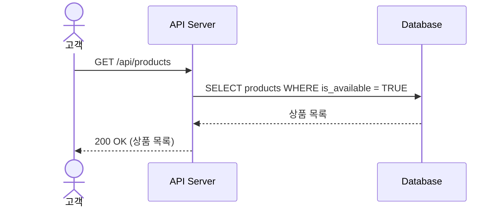

#### 시나리오 예시

```gherkin
Given 상품 데이터베이스에 10개의 상품이 있고
And 그 중 3개는 판매중 플래그가 FALSE이다
When 고객이 상품 목록을 조회하면
Then 판매중인 7개의 상품만 응답받는다
```

---

### US-002: 상품 상세 조회

**As a** 고객  
**I want to** 특정 상품의 상세 정보를 확인하고 싶다  
**So that** 구매 전 상품 정보를 자세히 파악할 수 있다

#### 인수 기준

- [ ] 상품 ID로 상세 정보를 조회할 수 있다
- [ ] 실시간 재고 수량이 표시된다
- [ ] 상품명, 가격, 설명, 카테고리 정보, 옵션 정보가 포함된다
- [ ] 존재하지 않는 상품 조회 시 404 에러를 반환한다

#### 시퀀스 다이어그램

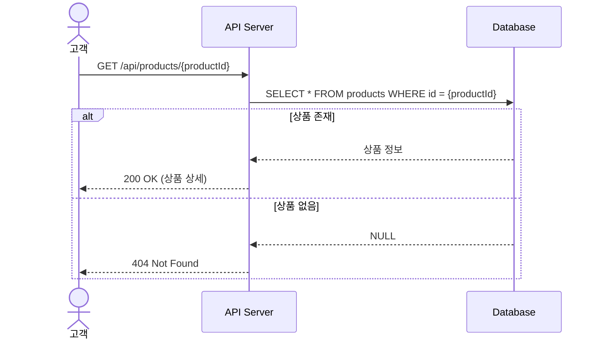

#### 시나리오 예시

```gherkin
Given 상품 "P001"이 존재하고 재고가 10개일 때
When 고객이 상품 "P001"을 조회하면
Then 상품 상세 정보와 재고 10개가 표시된다

Given 상품 "P999"가 존재하지 않을 때
When 고객이 상품 "P999"를 조회하면
Then 404 에러가 반환된다
```

---

### US-003: 인기 상품 조회 (캐시 기반)

**As a** 고객  
**I want to** 최근 인기 있는 상품을 확인하고 싶다  
**So that** 트렌디한 상품을 빠르게 찾을 수 있다

#### 인수 기준

- [ ] API는 하루에 한 번 배치로 생성된 인기상품 캐시 테이블에서 데이터를 조회한다
- [ ] 캐시에는 Top 5 상품의 순위, 상품 정보(상품ID, 이름, 가격, 카테고리), 마지막 판매 시각이 포함된다
- [ ] 캐시에 5개가 저장될 만큼 팔리지 않았다면, 만족하는 상품 갯수만 반환한다. 3일 간 전체 판매 수량이 0이라면 빈 배열을 반환한다.
- [ ] 캐시는 최근 3일간의 결제 완료된 주문만 집계하여 배치 시점 기준으로 계산되어 저장된다
- [ ] 판매 수가 동일한 경우 더 최근에 결제된 상품이 우선순위로 정렬되어 캐시에 저장된다

#### 시퀀스 다이어그램 (배치 — 하루 1회)

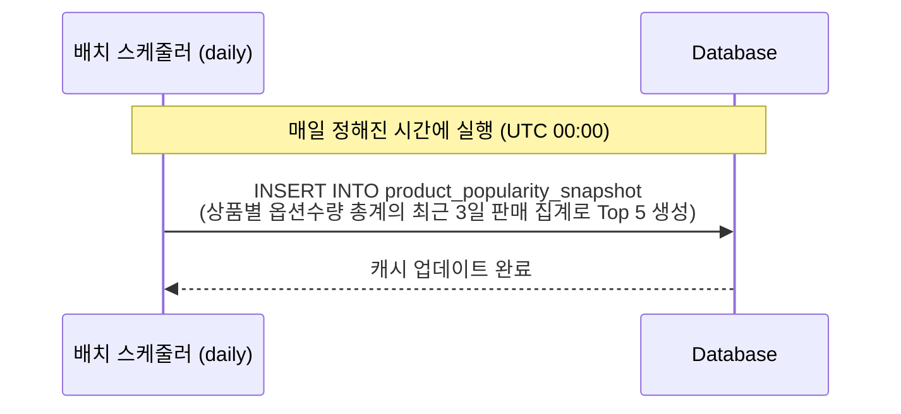

#### 시퀀스 다이어그램 (조회)

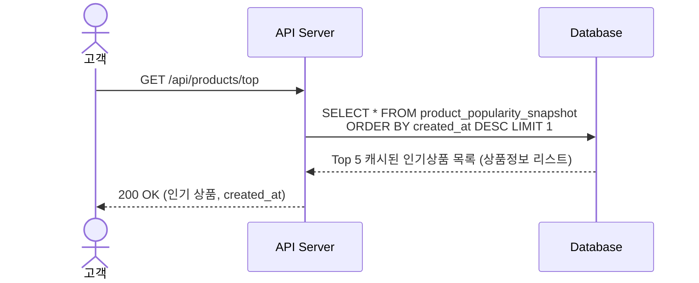

#### 시나리오 예시

```gherkin
Given 배치가 매일 실행되어 최근 3일간의 판매 집계를 생성하고 있고
And 오늘 캐시에 Top 5 상품 정보가 저장되어 있을 때
When 고객이 인기 상품을 조회하면
Then API는 product_popularity_snapshot에서 Top 5의 배열을 반환한다
```

---

## 2. 잔액 관리

### US-004: 잔액 조회

**As a** 고객  
**I want to** 내 계정의 잔액을 확인하고 싶다  
**So that** 구매 가능 금액을 파악할 수 있다

#### 인수 기준

- [ ] 로그인한 사용자의 현재 잔액을 조회할 수 있다
- [ ] 잔액은 원(KRW) 단위로 표시된다

#### 시퀀스 다이어그램

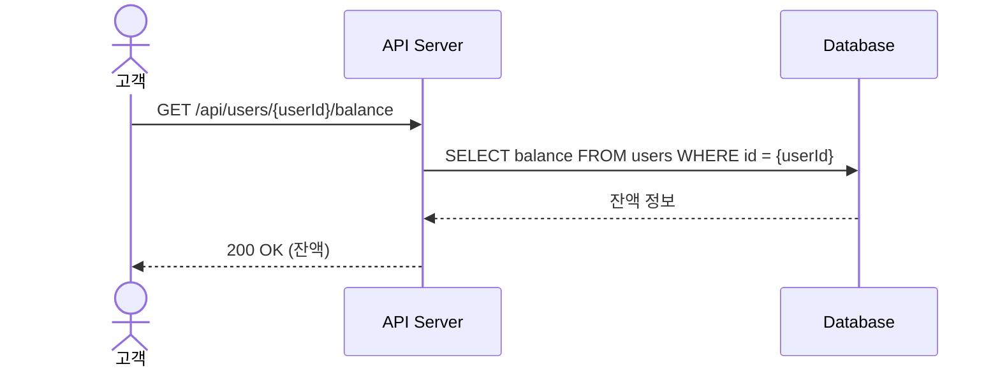

---

## 3. 장바구니

### US-005: 장바구니 상품 추가

**As a** 고객  
**I want to** 상품을 장바구니에 담고 싶다  
**So that** 나중에 한 번에 주문할 수 있다

#### 인수 기준

- [ ] 상품ID와 수량을 지정하여 장바구니에 추가할 수 있다
- [ ] 이미 담긴 상품은 수량이 증가한다
- [ ] 실시간 재고보다 많은 수량은 추가할 수 없다

#### 시퀀스 다이어그램

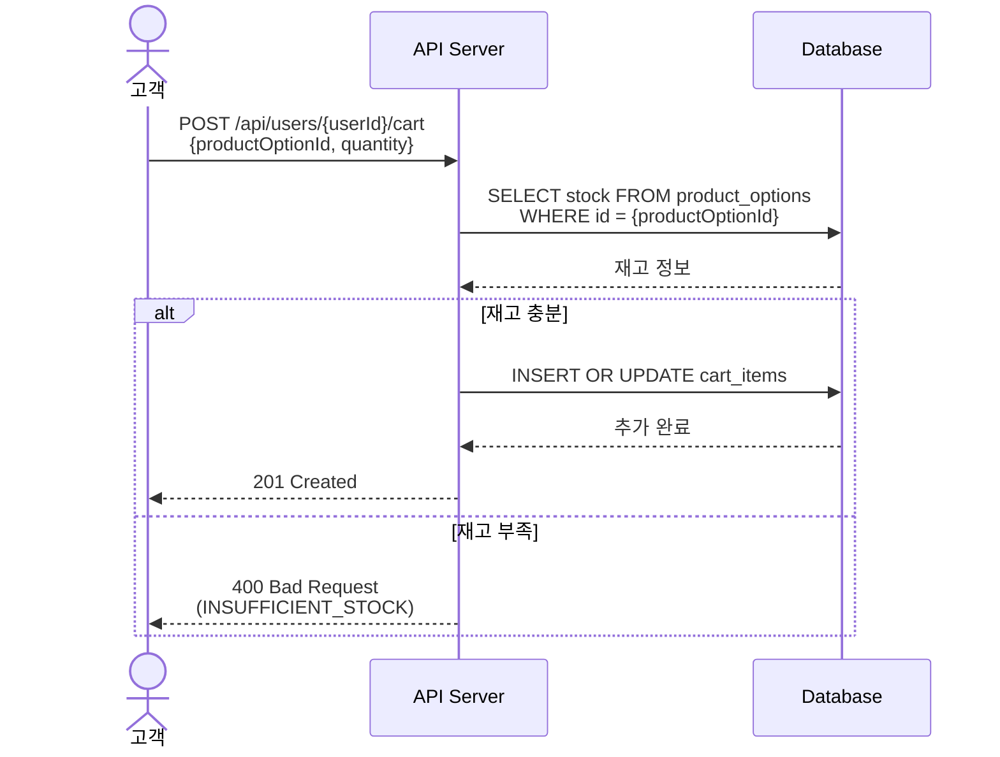

#### 시나리오 예시

```gherkin
Given 상품 "P001"의 재고가 10개이고
And 고객의 장바구니가 비어있을 때
When 고객이 상품 "P001"을 수량 3개로 장바구니에 추가하면
Then 장바구니에 해당 상품이 추가된다

Given 장바구니에 이미 상품 "P001"이 3개 담겨있을 때
When 고객이 상품 "P001"을 수량 2개로 추가하면
Then 장바구니의 수량이 5개로 증가한다
```

---

### US-006: 장바구니 조회

**As a** 고객  
**I want to** 장바구니에 담긴 상품을 확인하고 싶다  
**So that** 구매할 상품을 검토할 수 있다

#### 인수 기준

- [ ] 장바구니에 담긴 모든 상품 목록을 조회할 수 있다
- [ ] 각 상품의 이름, 가격, 수량, 소계가 표시된다

#### 시퀀스 다이어그램

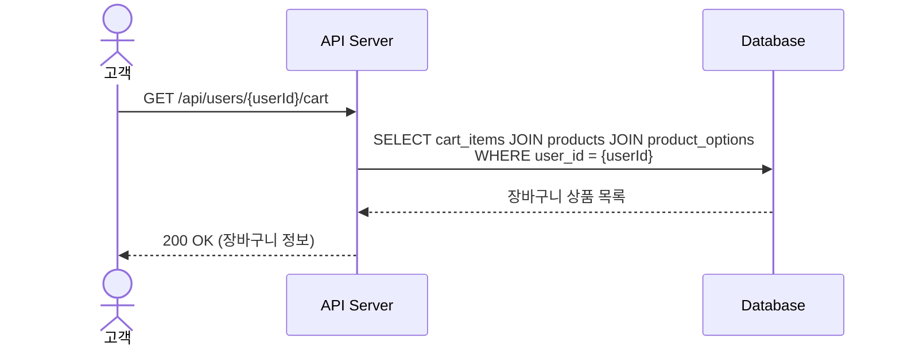

---

### US-007: 장바구니 상품 삭제

**As a** 고객  
**I want to** 장바구니에서 상품을 삭제하고 싶다  
**So that** 구매하지 않을 상품을 제거할 수 있다

#### 인수 기준

- [ ] 특정 상품을 장바구니에서 삭제할 수 있다
- [ ] 존재하지 않는 장바구니 항목 삭제 시 404 에러를 반환한다

#### 시퀀스 다이어그램

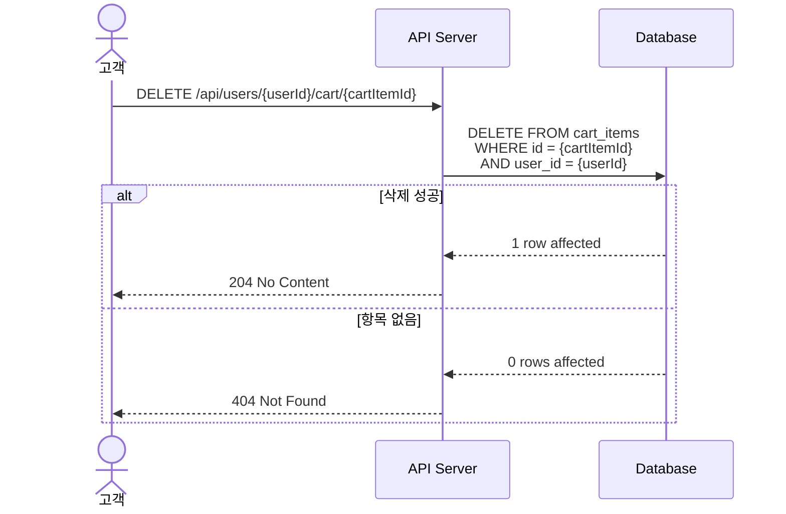

---

## 4. 주문/결제

### US-008: 주문서 생성

**As a** 고객  
**I want to** 장바구니 상품으로 주문서를 생성하고 싶다  
**So that** 결제를 진행할 수 있다

#### 인수 기준

- [ ] 장바구니 상품 기반으로 주문서가 생성된다
- [ ] 주문서 생성 시 재고를 검증하고 임시 선점한다
- [ ] 재고 부족 시 주문서 생성이 실패한다
- [ ] 주문서 상태는 PENDING으로 설정된다

#### 시퀀스 다이어그램

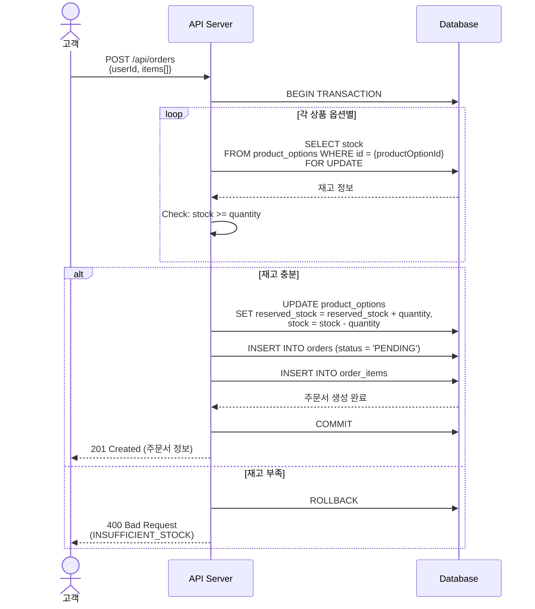

#### 시나리오 예시

```gherkin
Given 장바구니에 상품 "P001" 3개가 담겨있고
And 상품 "P001"의 재고가 10개일 때
When 고객이 주문서를 생성하면
Then 주문서가 PENDING 상태로 생성된다
And 상품 "P001"의 선점 재고가 3개 증가한다

Given 상품 "P001"의 재고가 2개이고
And 장바구니에 상품 "P001" 5개가 담겨있을 때
When 고객이 주문서를 생성하면
Then 재고 부족 에러가 반환된다
And 주문서는 생성되지 않는다
```

---

### US-009: 결제 처리

**As a** 고객  
**I want to** 주문서에 대한 결제를 완료하고 싶다  
**So that** 상품을 구매할 수 있다

#### 인수 기준

- [ ] PENDING 상태인 주문서만 결제할 수 있다
- [ ] 쿠폰을 선택하여 적용할 수 있다
- [ ] 잔액이 부족하면 결제가 실패한다
- [ ] 결제 성공 시 재고가 확정 차감되고 선점이 해제된다
- [ ] 결제 성공 시 주문 상태가 PAID로 변경된다
- [ ] 사용된 쿠폰은 USED 상태로 변경된다
- [ ] 결제 완료 후 외부 데이터 플랫폼으로 전송된다

#### 시퀀스 다이어그램

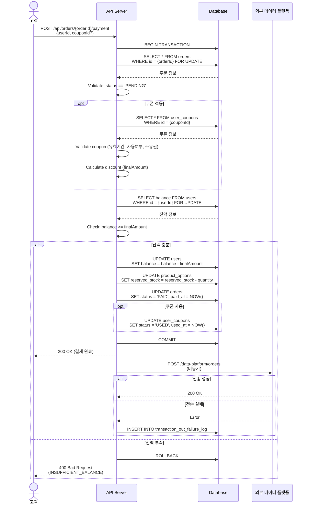

#### 시나리오 예시

```gherkin
Given 주문서 "ORDER-001"이 PENDING 상태이고
And 결제 금액이 50,000원이며
And 고객 잔액이 100,000원일 때
When 고객이 결제를 진행하면
Then 잔액이 50,000원 차감되어 50,000원이 된다
And 재고가 확정 차감되고 선점이 해제된다
And 주문 상태가 PAID로 변경된다
And 외부 데이터 플랫폼으로 주문 정보가 전송된다

Given 주문서 결제 금액이 150,000원이고
And 고객 잔액이 100,000원일 때
When 고객이 결제를 진행하면
Then 잔액 부족 에러가 반환된다
And 주문 상태는 PENDING으로 유지된다
```

---

### US-010: 결제 실패 시 선점된 재고 복원

**As a** 시스템  
**I want to** 결제 실패 시 선점한 재고를 복원하고 싶다  
**So that** 재고 정합성을 유지할 수 있다

#### 인수 기준

- [ ] 결제 실패 시 선점된 재고가 즉시 해제된다

#### 시퀀스 다이어그램

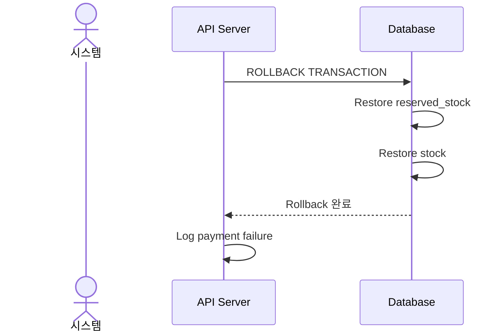

---

### US-011: 재고 선점 자동 해제

**As a** 시스템  
**I want to** 10분간 미결제 시 선점 재고를 자동 해제하고 싶다  
**So that** 재고가 무한정 잠기지 않도록 한다

#### 인수 기준

- [ ] 주문서 생성 후 10분이 지나면 선점 재고가 자동 해제된다
- [ ] 해제된 주문서로 결제 시도 시 안내 메시지가 표시된다
- [ ] 고객은 주문서를 다시 생성해야 한다

#### 시퀀스 다이어그램

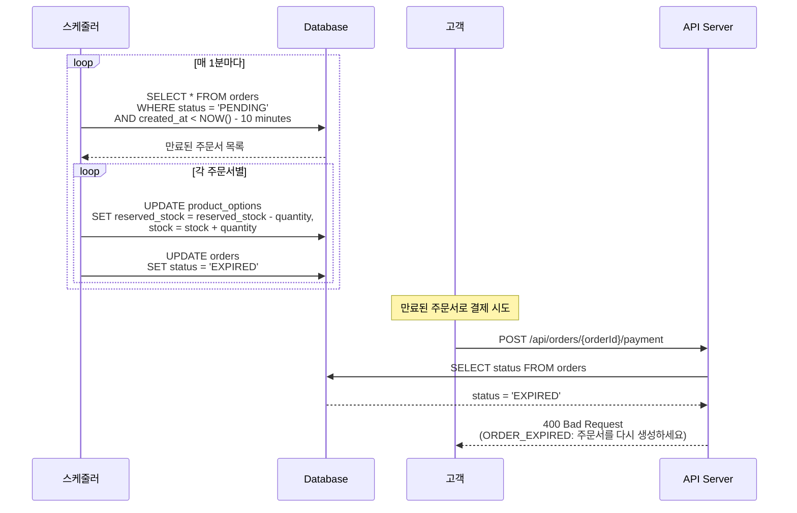

---

### US-012: 주문 내역 조회

**As a** 고객  
**I want to** 내 주문 내역을 확인하고 싶다  
**So that** 구매 이력을 관리할 수 있다

#### 인수 기준

- [ ] 본인의 모든 주문 내역을 조회할 수 있다
- [ ] 주문 상태별 필터링이 가능하다
- [ ] 각 주문의 상품 목록과 결제 금액이 표시된다

#### 시퀀스 다이어그램

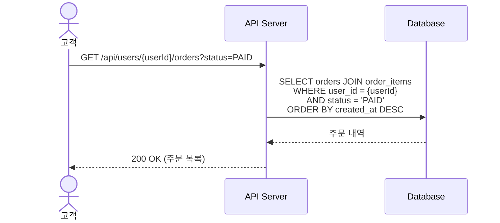

---

## 5. 쿠폰

### US-013: 쿠폰 발급 (선착순)

**As a** 고객  
**I want to** 한정 수량의 쿠폰을 발급받고 싶다  
**So that** 할인 혜택을 받을 수 있다

#### 인수 기준

- [ ] 선착순으로 쿠폰을 발급받을 수 있다
- [ ] 한 사용자는 동일 쿠폰을 1회만 발급받을 수 있다
- [ ] 발급 수량이 총 수량에 도달하면 발급이 불가능하다
- [ ] 동시 요청 시에도 수량 정합성이 보장된다

#### 시퀀스 다이어그램

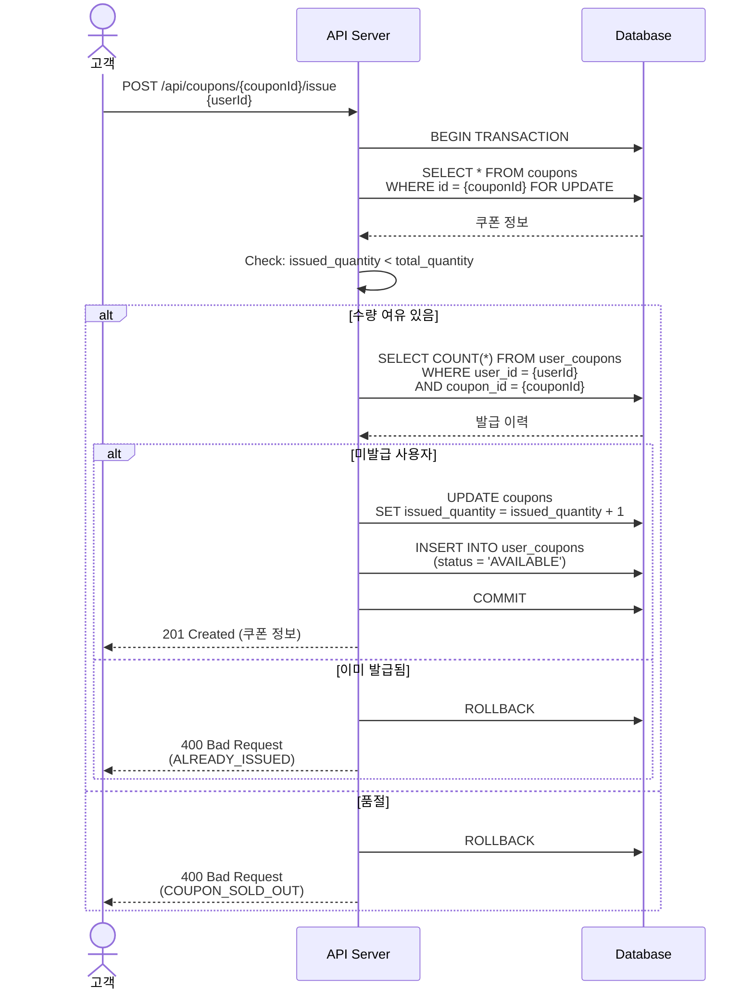

#### 시나리오 예시

```gherkin
Given 쿠폰 "COUPON_10"의 총 수량이 100개이고
And 현재 발급된 수량이 95개일 때
When 고객 "user1"이 쿠폰을 발급받으면
Then 쿠폰이 성공적으로 발급된다
And 발급 수량이 96개로 증가한다

Given 쿠폰 "COUPON_10"이 이미 품절되었을 때
When 고객이 쿠폰을 발급받으려 하면
Then 품절 에러가 반환된다

Given 고객 "user1"이 이미 쿠폰 "COUPON_10"을 발급받았을 때
When 고객 "user1"이 동일 쿠폰을 다시 발급받으려 하면
Then 중복 발급 에러가 반환된다
```

---

### US-014: 보유 쿠폰 조회

**As a** 고객  
**I want to** 내가 보유한 쿠폰을 확인하고 싶다  
**So that** 주문 시 사용할 쿠폰을 선택할 수 있다

#### 인수 기준

- [ ] 보유한 모든 쿠폰을 조회할 수 있다
- [ ] 쿠폰명, 할인율, 만료일, 사용 여부가 표시된다
- [ ] 사용 가능한 쿠폰만 필터링할 수 있다

#### 시퀀스 다이어그램

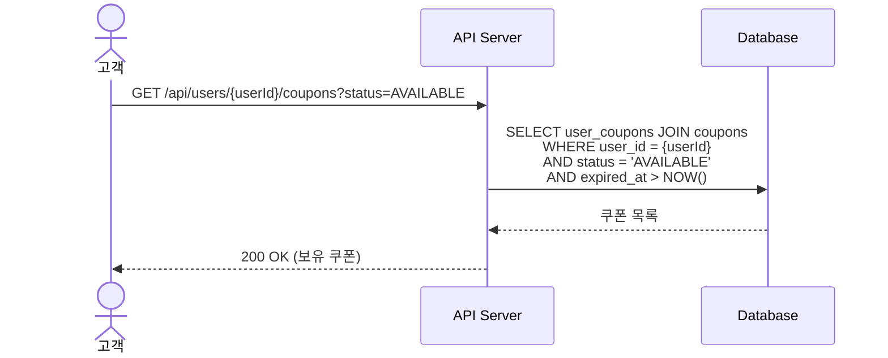

#### 시나리오 예시

```gherkin
Given 고객이 3개의 쿠폰을 보유하고 있고
And 그 중 1개는 만료되었고 1개는 사용되었을 때
When 고객이 사용 가능한 쿠폰을 조회하면
Then 1개의 사용 가능한 쿠폰만 반환된다
```

---

### US-015: 쿠폰 유효성 검증

**As a** 시스템  
**I want to** 주문 시 쿠폰의 유효성을 검증하고 싶다  
**So that** 유효한 쿠폰만 사용되도록 한다

#### 인수 기준

- [ ] 만료된 쿠폰은 사용할 수 없다
- [ ] 이미 사용된 쿠폰은 재사용할 수 없다
- [ ] 다른 사용자의 쿠폰은 사용할 수 없다
- [ ] 유효하지 않은 쿠폰 사용 시 적절한 에러가 반환된다

#### 시퀀스 다이어그램

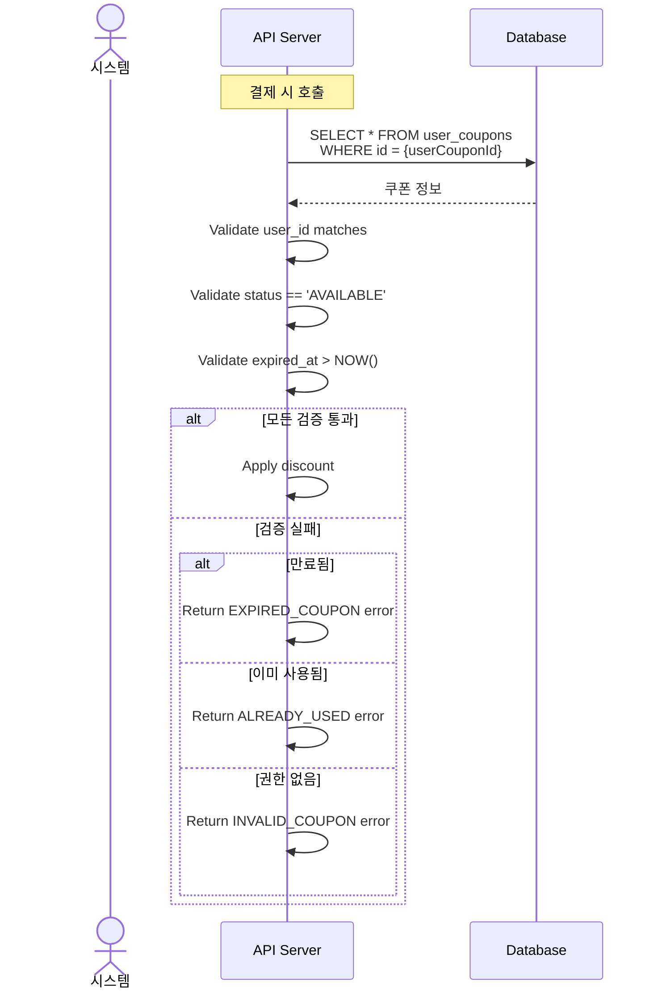

#### 시나리오 예시

```gherkin
Given 고객 "user1"이 쿠폰 "UC-001"을 보유하고 있고
And 쿠폰이 만료되었을 때
When 주문 시 해당 쿠폰을 적용하려 하면
Then 만료된 쿠폰 에러가 반환된다

Given 고객 "user1"이 쿠폰 "UC-002"를 이미 사용했을 때
When 동일 쿠폰을 다시 사용하려 하면
Then 이미 사용된 쿠폰 에러가 반환된다
```

---

## 부록: 전체 주문 플로우

### 전체 프로세스 시퀀스 다이어그램

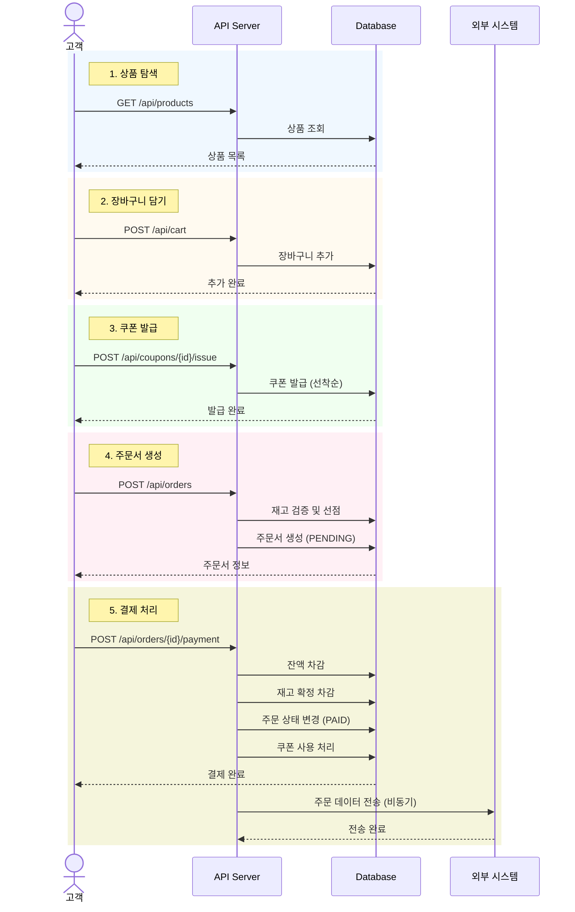

---

## 요약

본 문서는 이커머스 시스템의 **15개 사용자 스토리**를 정의하며, 각 스토리는 다음을 포함합니다:

- **사용자 관점의 목표** (As a, I want to, So that)
- **인수 기준** (Acceptance Criteria)
- **시퀀스 다이어그램** (Mermaid 기반)
- **시나리오 예시** (Gherkin 형식)

이를 통해 클라이언트와의 원활한 소통과 명확한 인수 테스트 시나리오를 확보할 수 있습니다.
